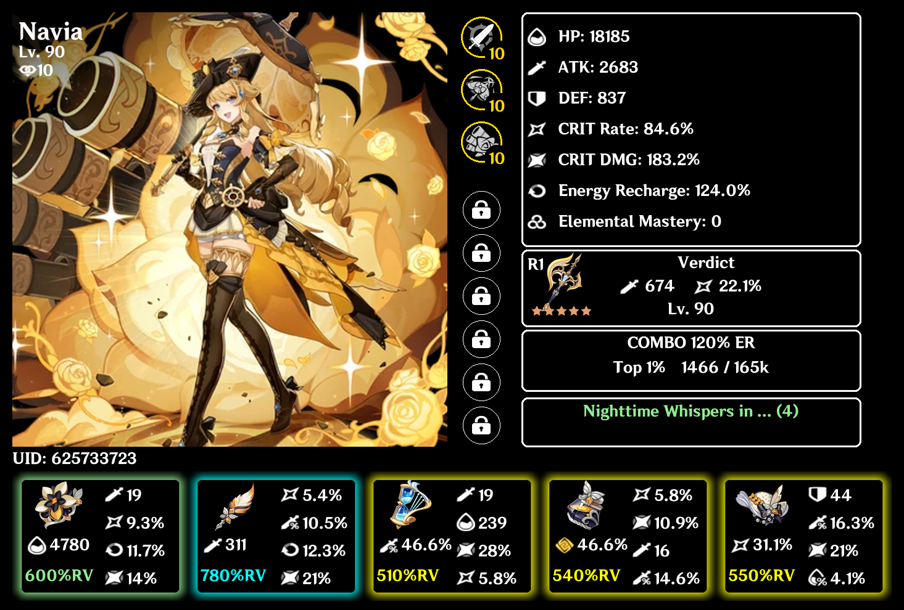
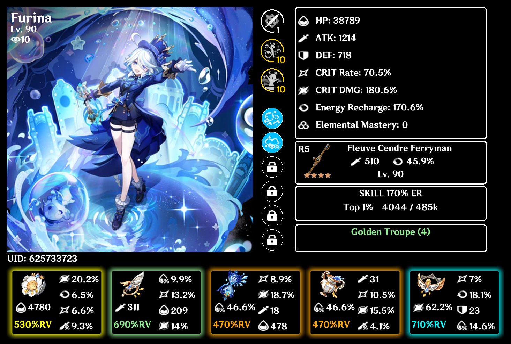

# roll-value-showcase

Hello! Welcome to the roll-value-showcase project.

This is a character build showcase tool for the game Genshin Impact, using Discord as the medium for delivery.

Here are some of the generated images!

> Note: this is a work in progress, I am using this project as a way to learn UI design. Let me know if you have any feedback!

**Navia**:

**Furina**:

## Invite the Bot!

Please use the following link to invite the bot to your server: https://discord.com/oauth2/authorize?client_id=1289695046186303541&permissions=9330816838721&integration_type=0&scope=bot

## Usage:

Once the bot is invited to your server, using it is simple! Just use the following slash command:

`/showcase_rv <uid>`, where `<uid>` is your in-game User ID.

Make sure your in-game character showcase allows for character detail viewing!

## Roadmap / Upcoming:

See [CHANGELOG](./CHANGELOG.md) for more info.

## Credits

Thank you to these tool developers!

- [Enka Network](https://api.enka.network/#/api)